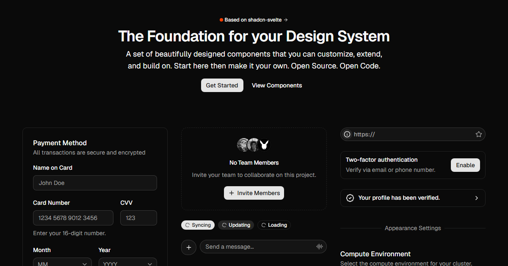

# shadcn-svelte-registry-template

A template for creating your own [shadcn-svelte](https://www.shadcn-svelte.com) compatible component registry.

Docs and component previews: **[shadcn-svelte-registry-template.vercel.app](https://shadcn-svelte-registry-template.vercel.app)**

[](https://shadcn-svelte-registry-template.vercel.app)

The UI components are in `src/lib/registry/ui`, the docs for each component are in
`src/lib/content/docs/components`, and the registry JSON file is `registry.json`. Read the
[shadcn-svelte registry docs](https://www.shadcn-svelte.com/docs/registry) for more
information on how registries work.

## Developing

Create a repo from this template (use GitHub's **Use this template** button), then:

```sh
npm install
npm run dev
```

## Making it yours

- Set `name` and `homepage` in `registry.json`.
- Update the registry URL and GitHub URL in `src/lib/constants.ts`. The docs pages
  use these to generate each component's `npx shadcn-svelte add` command.
- Edit the theme in `src/routes/layout.css` (the `:root`, `.dark`, and `@theme inline`
  blocks) to give your components their own look.
- Edit the components themselves in `src/lib/registry/ui`: change their markup,
  classes, and variants, or remove the ones you don't want to ship.

## Adding a new component

The easiest way is to copy an existing component. To start from scratch:

1. Create a folder in `src/lib/registry/ui` with the name of your component and add
   its Svelte files (e.g. `button.svelte`, `index.ts`).
2. Add examples in `src/lib/registry/examples` and a docs file in
   `src/lib/content/docs/components` (e.g. `button.md`). Docs pages embed examples
   by name: `<ComponentPreview name="button-demo" />` renders the matching example file.
3. Add an entry for your component in `registry.json` with the paths to its files.
4. Run `npm run registry:build` to generate `static/r/<name>.json`, which is the file
   the CLI fetches. Production builds run this automatically.

npm packages your components import are detected automatically when the registry is
built, so they're installed alongside your components by the CLI.

## Building

To create a production version of your app:

```sh
npm run build
```

This also runs `npm run registry:build`, which generates the registry JSON files in
`static/r` using your `registry.json` file.

You can preview the production build with `npm run preview`.

## Deploying

Deploy like any SvelteKit app. Once deployed, anyone can add your components with:

```sh
npx shadcn-svelte@latest add https://your-site.com/r/button.json
```
